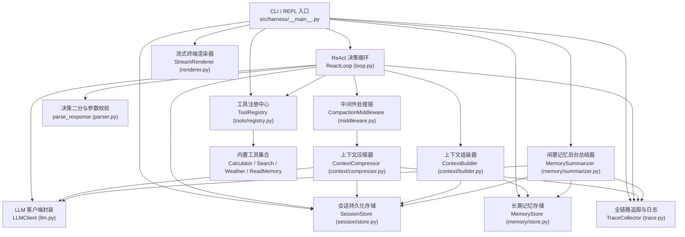

# CODEGRAPH.md — Agent Runtime 代码图谱与架构解析

> 本文件基于 `codegraph` 代码图谱工具生成与维护，记录了本项目的完整代码结构、核心组件依赖关系、数据流转链路与调用图谱（Call Graph）。
> 在修改代码或分析链路前，请先查阅本文档，或使用 `codegraph` CLI 实时探索。

---

## 1. 架构总览

本项目从零实现了一个轻量级、无第三方 Agent 框架依赖的 **最小可用 Agent Runtime**。核心基于 ReAct（Reasoning + Acting）决策循环，集成会话隔离、上下文滑动压缩、长期记忆沉淀与全链路调用追踪。

### 1.1 系统拓扑图 (System Topology)



---

## 2. 核心链路与执行数据流 (Data Flow & Lifecycles)

### 2.1 单次用户输入 ReAct 主决策循环 (ReAct Loop)

```mermaid
sequenceDiagram
    autonumber
    actor User as 用户
    participant REPL as REPL (__main__.py)
    participant Loop as ReactLoop (loop.py)
    participant Mid as CompactionMiddleware
    participant Comp as ContextCompressor
    participant Build as ContextBuilder
    participant LLM as LLMClient (DeepSeek)
    participant Parser as Parser (parser.py)
    participant Tool as BaseTool / Registry
    participant Store as SessionStore (JSONL)
    participant Trace as TraceCollector

    User->>REPL: 输入文本 (Prompt)
    REPL->>Loop: run(user_input, session_id, on_event)
    Loop->>Trace: start_trace(session_id)
    
    loop 最多 max_rounds 轮次
        Loop->>Mid: before_model(state)
        opt 轮次达到压缩阈值
            Mid->>Comp: compact(session_id, trace_id)
            Comp->>Store: append_compaction(...)
        end
        Loop->>Build: build(session_id, user_input)
        Note over Build: 组合 System Prompt + 记忆摘要 + 压缩摘要 + 历史消息
        opt round_no == 0
            Loop->>Store: append_message(user_input)
        end
        Loop->>Trace: start_llm_span(trace_id, model, request)
        Loop->>LLM: invoke / stream(request, tools)
        LLM-->>Loop: AIMessage (含 reasoning_content, tool_calls)
        Loop->>Store: append_message(assistant)
        Loop->>Trace: end_llm_span(...)
        Loop->>Parser: parse_response(message)
        
        alt 决策为 FinalAnswer
            Parser-->>Loop: FinalAnswer(content)
            Loop->>Mid: after_model(state)
            Loop-->>REPL: LoopResult(answer, rounds, tool_call_count, truncated=False)
        else 决策为 ToolCallBatch
            Parser-->>Loop: ToolCallBatch(calls)
            loop 批次中每个 ToolCall
                Loop->>Parser: validate_arguments(call, tool.parameters)
                Loop->>Trace: start_tool_span(...)
                alt 参数有效
                    Loop->>Tool: execute(**call.args) (受超时约束)
                    Tool-->>Loop: 执行结果 string
                else 校验失败 / 超时 / 异常
                    Loop-->>Loop: 构造结构化错误 JSON (D23 契约)
                end
                Loop->>Trace: end_tool_span(...)
                Loop->>Store: append_message(role="tool", call_id, content)
            end
        end
    end
    opt 超过最大轮数仍未收敛
        Loop-->>REPL: LoopResult(已达最大轮次截断提示, truncated=True)
    end
    REPL-->>User: 渲染输出 (流式分通道或整段)
```

---

## 3. 模块结构与关键符号索引 (Module & Symbol Index)

### 3.1 运行时核心组件

| 模块文件 | 关键类 / 函数 | 职责与设计要点 |
| :--- | :--- | :--- |
| [`src/harness/loop.py`](file:///Users/zhanghongze/PycharmProjects/guang-chen-agent-harness-test/src/harness/loop.py) | [`ReactLoop`](file:///Users/zhanghongze/PycharmProjects/guang-chen-agent-harness-test/src/harness/loop.py#L39)<br/>[`LoopResult`](file:///Users/zhanghongze/PycharmProjects/guang-chen-agent-harness-test/src/harness/loop.py#L30) | 驱动 ReAct 循环，首轮落库 user 消息，支持单次交互 `max_rounds` 上限与流式事件 `_tee` 转发。 |
| [`src/harness/parser.py`](file:///Users/zhanghongze/PycharmProjects/guang-chen-agent-harness-test/src/harness/parser.py) | [`parse_response`](file:///Users/zhanghongze/PycharmProjects/guang-chen-agent-harness-test/src/harness/parser.py#L48)<br/>[`validate_arguments`](file:///Users/zhanghongze/PycharmProjects/guang-chen-agent-harness-test/src/harness/parser.py#L60)<br/>[`FinalAnswer`](file:///Users/zhanghongze/PycharmProjects/guang-chen-agent-harness-test/src/harness/parser.py#L19)<br/>[`ToolCallBatch`](file:///Users/zhanghongze/PycharmProjects/guang-chen-agent-harness-test/src/harness/parser.py#L26) | 输出解析与二分判定。对模型返回的 JSON 参数执行必填项与未知字段的显式校验，生成标准中文结构化错误，不吞异常。 |
| [`src/harness/llm.py`](file:///Users/zhanghongze/PycharmProjects/guang-chen-agent-harness-test/src/harness/llm.py) | [`LLMClient`](file:///Users/zhanghongze/PycharmProjects/guang-chen-agent-harness-test/src/harness/llm.py#L67)<br/>[`AIMessage`](file:///Users/zhanghongze/PycharmProjects/guang-chen-agent-harness-test/src/harness/llm.py#L48)<br/>[`collect_stream`](file:///Users/zhanghongze/PycharmProjects/guang-chen-agent-harness-test/src/harness/llm.py#L289)<br/>`StreamEvent` | 封装 OpenAI SDK 协议对接 DeepSeek。支持同步 `invoke` 与生成器 `stream`，流式事件细分为 `ReasoningDelta`、`TextDelta`、`ToolCallDelta`、`UsageEvent`、`DoneEvent`。 |
| [`src/harness/middleware.py`](file:///Users/zhanghongze/PycharmProjects/guang-chen-agent-harness-test/src/harness/middleware.py) | [`Middleware`](file:///Users/zhanghongze/PycharmProjects/guang-chen-agent-harness-test/src/harness/middleware.py#L31)<br/>[`LoopState`](file:///Users/zhanghongze/PycharmProjects/guang-chen-agent-harness-test/src/harness/middleware.py#L17) | 中间件规范基类。定义 `before_model`、`after_model` 扩展点，支撑超长压缩等会话级处理。 |
| [`src/harness/config.py`](file:///Users/zhanghongze/PycharmProjects/guang-chen-agent-harness-test/src/harness/config.py) | [`RuntimeConfig`](file:///Users/zhanghongze/PycharmProjects/guang-chen-agent-harness-test/src/harness/config.py#L30) | 运行时全局配置加载器。解析环境变量覆盖默认项（模型、base_url、API key、超时时间、上下文阈值等）。 |
| [`src/harness/prompts.py`](file:///Users/zhanghongze/PycharmProjects/guang-chen-agent-harness-test/src/harness/prompts.py) | `SYSTEM_PROMPT`<br/>`COMPACTION_PROMPT`<br/>`MEMORY_SUMMARY_PROMPT` | 集中放置全系统提示词模板，杜绝硬编码散落在逻辑代码中。 |

---

### 3.2 上下文与会话管理 (Context, Session & Memory)

| 模块文件 | 关键类 / 函数 | 职责与设计要点 |
| :--- | :--- | :--- |
| [`src/harness/session/store.py`](file:///Users/zhanghongze/PycharmProjects/guang-chen-agent-harness-test/src/harness/session/store.py) | [`SessionStore`](file:///Users/zhanghongze/PycharmProjects/guang-chen-agent-harness-test/src/harness/session/store.py#L21) | 基于 `data/sessions/<id>.jsonl` 的只追加存储。按序号单调递增，隔离不同会话；提供 `read_context_messages` 自动跳过已被压缩的历史。 |
| [`src/harness/context/builder.py`](file:///Users/zhanghongze/PycharmProjects/guang-chen-agent-harness-test/src/harness/context/builder.py) | [`ContextBuilder`](file:///Users/zhanghongze/PycharmProjects/guang-chen-agent-harness-test/src/harness/context/builder.py#L58)<br/>[`estimate_tokens`](file:///Users/zhanghongze/PycharmProjects/guang-chen-agent-harness-test/src/harness/context/builder.py#L27) | 组装 LLM 输入上下文：`System Prompt`（内嵌长期记忆） + `最后一次压缩摘要` + `未压缩历史消息` + `当前用户输入`。 |
| [`src/harness/context/compressor.py`](file:///Users/zhanghongze/PycharmProjects/guang-chen-agent-harness-test/src/harness/context/compressor.py) | [`ContextCompressor`](file:///Users/zhanghongze/PycharmProjects/guang-chen-agent-harness-test/src/harness/context/compressor.py#L31)<br/>[`CompactionMiddleware`](file:///Users/zhanghongze/PycharmProjects/guang-chen-agent-harness-test/src/harness/context/compressor.py#L242) | 超长上下文滑动压缩。检测到超过 `compaction_threshold_rounds` 时截断前半部分，调用 LLM 递归生成摘要并写回 `SessionStore`，保证工具调用与返回成对完整。 |
| [`src/harness/memory/store.py`](file:///Users/zhanghongze/PycharmProjects/guang-chen-agent-harness-test/src/harness/memory/store.py) | [`MemoryStore`](file:///Users/zhanghongze/PycharmProjects/guang-chen-agent-harness-test/src/harness/memory/store.py#L32) | 基于文件系统的长期记忆库 `data/memory/<session_id>/`。支持内容去重写入、多条记忆增量合并 (`merge`) 与摘要渲染。 |
| [`src/harness/memory/summarizer.py`](file:///Users/zhanghongze/PycharmProjects/guang-chen-agent-harness-test/src/harness/memory/summarizer.py) | [`MemorySummarizer`](file:///Users/zhanghongze/PycharmProjects/guang-chen-agent-harness-test/src/harness/memory/summarizer.py#L36) | 闲置会话后台总结 Daemon 线程。周期扫描距上次修改超过 `idle_seconds` 的会话，异步调用 LLM 生成记忆并持久化。 |

---

### 3.3 工具系统 (Tools System)

| 模块文件 | 关键类 / 函数 | 职责与设计要点 |
| :--- | :--- | :--- |
| [`src/harness/tools/base.py`](file:///Users/zhanghongze/PycharmProjects/guang-chen-agent-harness-test/src/harness/tools/base.py) | [`BaseTool`](file:///Users/zhanghongze/PycharmProjects/guang-chen-agent-harness-test/src/harness/tools/base.py#L32)<br/>[`ToolExecutionError`](file:///Users/zhanghongze/PycharmProjects/guang-chen-agent-harness-test/src/harness/tools/base.py#L13) | 工具抽象基类。声明 `name`、`description`、`parameters` Schema，并规定 `execute(**kwargs)` 统一返回字符串协议。 |
| [`src/harness/tools/registry.py`](file:///Users/zhanghongze/PycharmProjects/guang-chen-agent-harness-test/src/harness/tools/registry.py) | [`ToolRegistry`](file:///Users/zhanghongze/PycharmProjects/guang-chen-agent-harness-test/src/harness/tools/registry.py#L16)<br/>[`ToolNotFoundError`](file:///Users/zhanghongze/PycharmProjects/guang-chen-agent-harness-test/src/harness/tools/registry.py#L11) | 工具注册中心。负责工具注册、按名获取、导出 OpenAI Function Calling 规范的 tools schema 列表。 |
| [`src/harness/tools/calculator.py`](file:///Users/zhanghongze/PycharmProjects/guang-chen-agent-harness-test/src/harness/tools/calculator.py) | [`CalculatorTool`](file:///Users/zhanghongze/PycharmProjects/guang-chen-agent-harness-test/src/harness/tools/calculator.py#L40) | 安全四则运算器。基于 Python AST 语法树白名单安全解析计算，严禁 `eval()` 执行任意代码。 |
| [`src/harness/tools/search.py`](file:///Users/zhanghongze/PycharmProjects/guang-chen-agent-harness-test/src/harness/tools/search.py) | [`SearchTool`](file:///Users/zhanghongze/PycharmProjects/guang-chen-agent-harness-test/src/harness/tools/search.py#L12) | 模拟联网搜索工具。基于关键词提供模拟检索结果。 |
| [`src/harness/tools/weather.py`](file:///Users/zhanghongze/PycharmProjects/guang-chen-agent-harness-test/src/harness/tools/weather.py) | [`WeatherTool`](file:///Users/zhanghongze/PycharmProjects/guang-chen-agent-harness-test/src/harness/tools/weather.py#L12) | 模拟天气查询工具。按城市返回天气与温度信息。 |
| [`src/harness/tools/read_memory.py`](file:///Users/zhanghongze/PycharmProjects/guang-chen-agent-harness-test/src/harness/tools/read_memory.py) | [`ReadMemoryTool`](file:///Users/zhanghongze/PycharmProjects/guang-chen-agent-harness-test/src/harness/tools/read_memory.py#L12) | 全局长期记忆读取工具。按文件名读取记忆详细内容并返回。 |
| [`src/harness/tools/todo.py`](file:///Users/zhanghongze/PycharmProjects/guang-chen-agent-harness-test/src/harness/tools/todo.py) | [`WriteTodosTool`](file:///Users/zhanghongze/PycharmProjects/guang-chen-agent-harness-test/src/harness/tools/todo.py#L16) | 待办写入工具。全量替换当前会话的待办清单（status 三态），经 `CURRENT_SESSION_ID` 上下文绑定实现会话隔离与多 agent 并发共享。 |
| [`src/harness/state.py`](file:///Users/zhanghongze/PycharmProjects/guang-chen-agent-harness-test/src/harness/state.py) | [`RuntimeState`](file:///Users/zhanghongze/PycharmProjects/guang-chen-agent-harness-test/src/harness/state.py#L24)<br/>[`CURRENT_SESSION_ID`](file:///Users/zhanghongze/PycharmProjects/guang-chen-agent-harness-test/src/harness/state.py#L17) | 进程级公共内存状态（按会话键控、线程安全、不落盘）与执行上下文会话绑定（ContextVar，协程/线程天然隔离）。 |

---

### 3.4 追踪、可观测性与 CLI 入口

| 模块文件 | 关键类 / 函数 | 职责与设计要点 |
| :--- | :--- | :--- |
| [`src/harness/trace.py`](file:///Users/zhanghongze/PycharmProjects/guang-chen-agent-harness-test/src/harness/trace.py) | [`TraceCollector`](file:///Users/zhanghongze/PycharmProjects/guang-chen-agent-harness-test/src/harness/trace.py#L143)<br/>[`JsonlExporter`](file:///Users/zhanghongze/PycharmProjects/guang-chen-agent-harness-test/src/harness/trace.py#L75) | 分布式链路追踪标准实现。管理 Trace 与父子 Span 生命周期，自动记录 LLM 思考耗时、token 消耗、工具输入输出，落盘为 JSONL 文件。 |
| [`src/harness/renderer.py`](file:///Users/zhanghongze/PycharmProjects/guang-chen-agent-harness-test/src/harness/renderer.py) | [`StreamRenderer`](file:///Users/zhanghongze/PycharmProjects/guang-chen-agent-harness-test/src/harness/renderer.py#L15)<br/>[`render_event`](file:///Users/zhanghongze/PycharmProjects/guang-chen-agent-harness-test/src/harness/renderer.py#L70) | 流式事件终端渲染器与状态管理。维护思考通道（带前缀）与正文通道（无前缀）的状态切换，逐片委托写入与回合结束换行补齐。 |
| [`src/harness/__main__.py`](file:///Users/zhanghongze/PycharmProjects/guang-chen-agent-harness-test/src/harness/__main__.py) | [`main`](file:///Users/zhanghongze/PycharmProjects/guang-chen-agent-harness-test/src/harness/__main__.py#L187)<br/>[`run_repl`](file:///Users/zhanghongze/PycharmProjects/guang-chen-agent-harness-test/src/harness/__main__.py#L63)<br/>[`_build_registry`](file:///Users/zhanghongze/PycharmProjects/guang-chen-agent-harness-test/src/harness/__main__.py#L177) | 应用启动装配入口与交互式 REPL。内置命令（`/new`、`/switch`、`/sessions`、`/history`、`/exit`）拦截，流式思考与正文分通道渲染。 |

---

## 4. 关键调用链路矩阵 (Call Graph Matrix)

通过 `codegraph callers` 与 `codegraph callees` 萃取的核心调用关系：

### 4.1 `ReactLoop.run` 外部调用者与内部调用链
- **调用者 (Callers)**:
  - `src/harness/__main__.py`: `run_repl`
  - `tests/test_loop.py`: 单元测试与集成测试用例
- **内部调用的关键方法 (Callees)**:
  - `TraceCollector.start_trace` (生成链路唯一 trace_id)
  - `ToolRegistry.to_openai_tools` (序列化工具声明)
  - `CompactionMiddleware.before_model` (前置检查并触发压缩)
  - `ContextBuilder.build` (组装当前完整上下文)
  - `SessionStore.append_message` (落库 user / assistant / tool 消息)
  - `TraceCollector.start_llm_span` / `end_llm_span` (追踪模型耗时与用量)
  - `LLMClient.invoke` / `stream` (模型交互)
  - `parser.parse_response` (二分最终回答或工具调用)
  - `ReactLoop._handle_tool_call` (工具执行与超时调度)

### 4.2 `parse_response` 关键调用图
- **调用者 (Callers)**:
  - `src/harness/loop.py:61` (`ReactLoop.run`)
  - `tests/test_parser.py` (单元测试)
- **输入**: `AIMessage`
- **输出**: `FinalAnswer(content=...)` 或 `ToolCallBatch(calls=[...])`

### 4.3 `ContextCompressor.compact` 关键调用图
- **触发源 (Callers)**:
  - `CompactionMiddleware.before_model` (每轮请求模型前检测 `should_compact`)
  - `tests/context/test_compressor.py`
- **内部依赖**:
  - `SessionStore.load_records` (加载待压缩消息)
  - `LLMClient.invoke` (挂载 `kind="compaction"` 的独立 span 生成精炼摘要)
  - `SessionStore.append_compaction` (写入压缩断点记录)

---

## 5. CodeGraph 使用公约与常用指令 (Operational Guide)

本项目将 `codegraph` 作为代码架构与逻辑分析的首要事实源。任何代码分析与逻辑修改必须遵循以下命令规范：

### 5.1 场景与命令速查

| 场景 | 推荐命令 | 说明 |
| :--- | :--- | :--- |
| **任务前分析** | `codegraph context "<任务/需求描述>"` | 一键提取与当前任务相关的核心符号、上下游依赖与关联代码块 |
| **模块探索** | `codegraph explore "<关键词/模块名>"` | 探索指定功能域的符号源码与调用链路径（如 `codegraph explore "harness"`） |
| **追查调用来源** | `codegraph callers <符号名>` | 查询函数或类在全工程中被哪些文件/方法调用（如 `codegraph callers parse_response`） |
| **追查下游调用** | `codegraph callees <符号名>` | 查询函数内部调用了哪些外部符号（如 `codegraph callees run`） |
| **影响范围评估** | `codegraph impact <符号名>` | 修改某关键符号前，评估会受到直接或间接影响的文件与模块 |
| **测试关联分析** | `codegraph affected [文件路径...]` | 修改源代码后，快速找出直接受影响的测试用例文件 |
| **索引状态查看** | `codegraph status` | 查看当前代码图谱的节点、边数及 SQLite 数据库状态 |
| **代码修改后同步** | `codegraph sync` | **强制规范**：代码修改后立即执行，增量同步索引数据库 |

---

## 6. 图谱维护与更新纪律

1. **不可绕过图谱凭空猜测**：编写代码前，优先使用 `codegraph` 追寻调用链路，确保新增代码与既有架构契约保持一致。
2. **每次修改后强制 Sync**：每次完成代码写入或重构后，必须在终端执行 `codegraph sync`，使图谱保持与工作区一致。
3. **架构变动同步更新本文档**：若调整了模块划分、核心循环协议或中间件结构，必须同步更新本 `CODEGRAPH.md` 文档。
